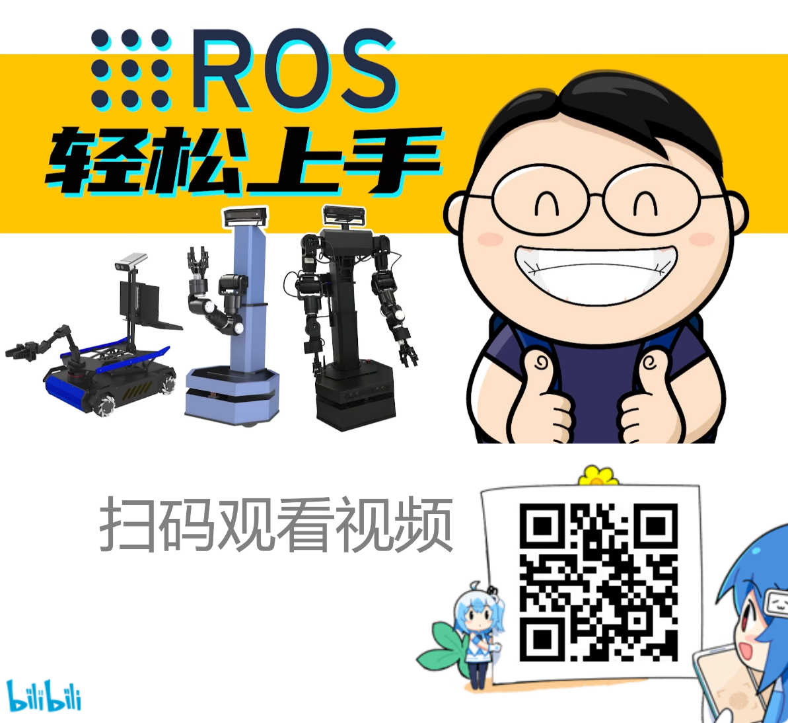
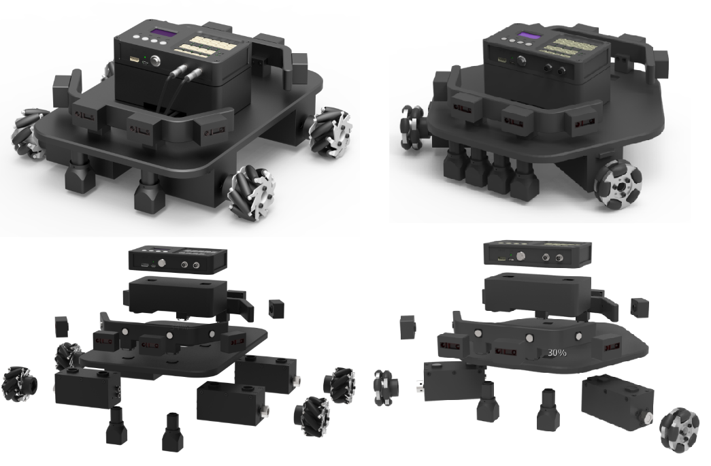
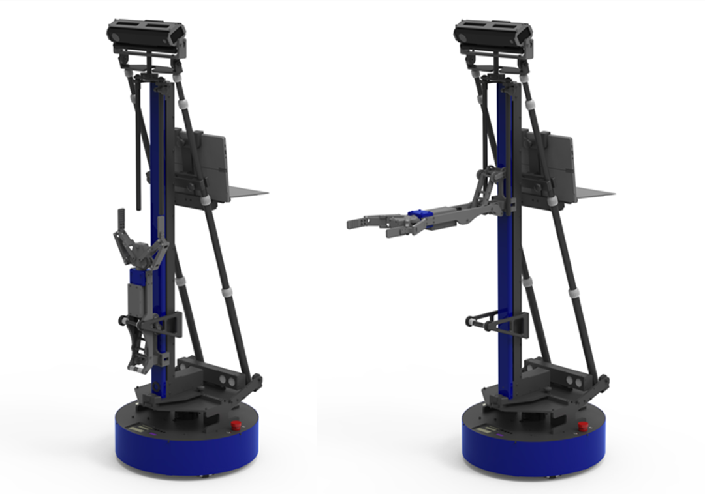
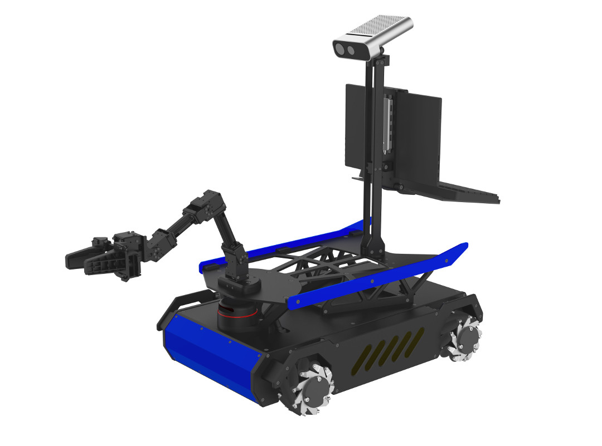
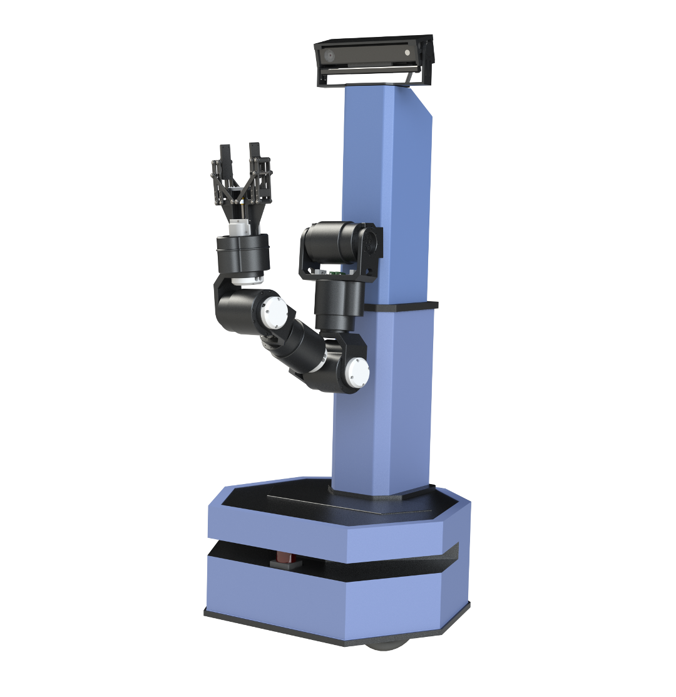
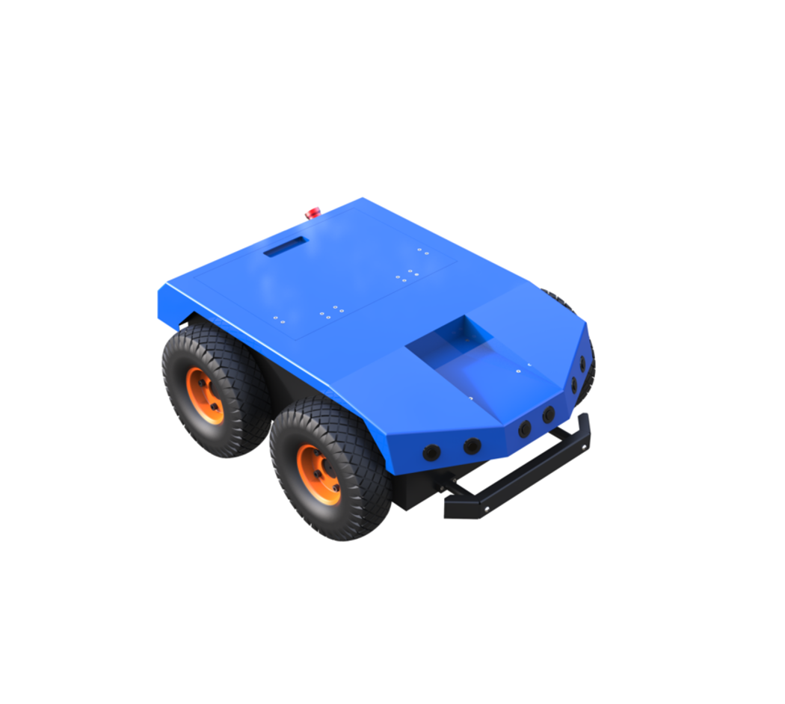
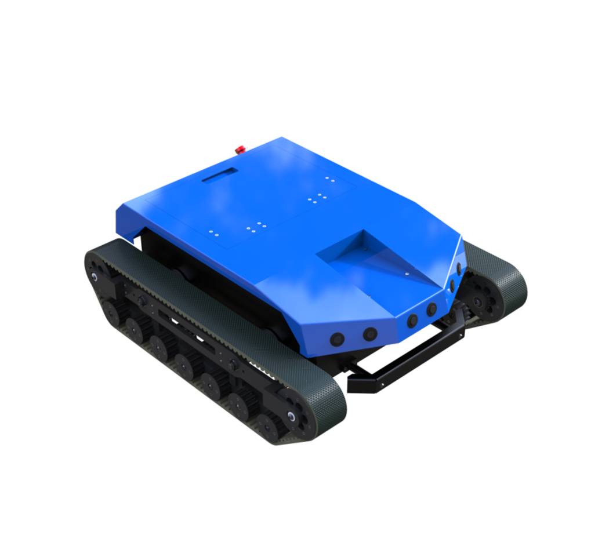
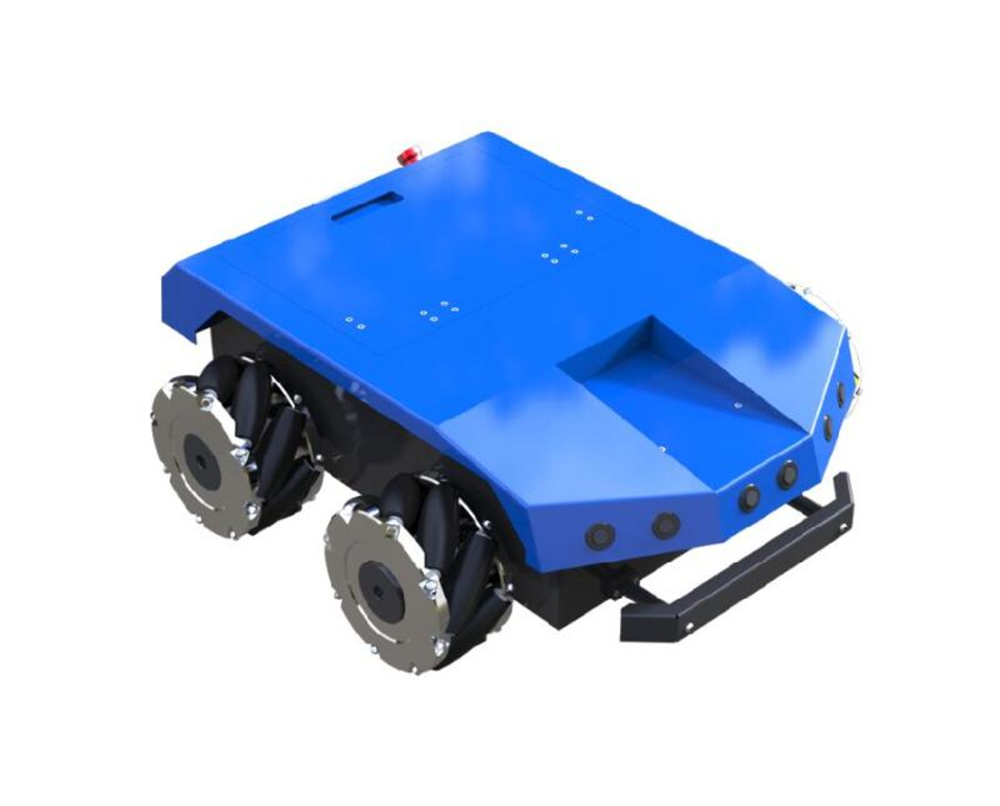

# ChatGPT开源ROS软件包

## 项目网址
https://github.com/play-with-chatgpt/wpr_chatgpt/

## 使用步骤

1.  获取源码:
```
cd ~/catkin_ws/src/
git clone https://github.com/play-with-chatgpt/wpr_chatgpt.git
```
2. 安装依赖项:  
```
cd ~/catkin_ws/src/wpr_chatgpt/scripts
./install_deps.sh
```
3. 编译
```
cd ~/catkin_ws
catkin_make
```
4. 将OpenAI的API Key填写到wpr_chatgpt/config/api_key.yaml中。
5. 启动ChatGPT节点
ChatGPT接口：
```
roslaunch wpr_chatgpt chat.launch
```
GPT-3接口：
```
roslaunch wpr_chatgpt start.launch
```
6. 发送问题句子进行测试
```
rosrun wpr_chatgpt str_pub.py 你好
```

## 使用方法视频
视频网址：https://www.bilibili.com/video/BV1we4y1w73g

## ROS快速入门视频课
视频网址：https://www.bilibili.com/video/BV1BP4y1o7pw


## 声明：以下是广告
[北京六部工坊科技有限公司](http://www.6-robot.com)是一家专门为高校提供机器人专业课程建设方案的公司，可以为学校用户提供从底层硬件开发到上层算法应用，一整套软硬件教学方案。除了提供教案教材参考资料，六部工坊还提供一系列机器人教学实验产品。协助高校客户完成机器人教学体系的升级和建设。详细信息请访问官方网址：http://www.6-robot.com

### 1. 启智模块机器人套件
模块化自由组装，复现多种机器人底盘。通过一系列STM32教学实验，帮助学生了解机器人底层硬件原理。


### 2. 启智ROS机器人
全向移动底盘，折叠连杆结构，收纳扩展搬运都非常便捷。通过一系列包含传感控制导航视觉抓取等实验，帮助学生掌握ROS在各种机器人功能中的使用方法。


### 3. 启智MANI机器人
麦克纳姆轮底盘，高精度立体视觉，四自由度机械臂，搭载Jeston Xavier NX主控，具备神经网络加速功能。通过一系列包含传感控制导航视觉抓取等实验，帮助学生掌握神经网络识别和移动抓取在机器人应用中的结合。


### 4. 启明服务机器人
高强度钢制结构，大功率负载底盘，工业级机械臂，高标准防护等级。可投入实际应用的大型服务机器人，主要用于科研竞赛及智能仓储等应用场景。


### 5.启程4全地形机器人
高强度钢制结构，大功率负载底盘，全地形适应能力，高标准防护等级。可通过更换轮组模块适应多种地形的室外机器人，主要用于科研竞赛及户外巡检等应用场景。



